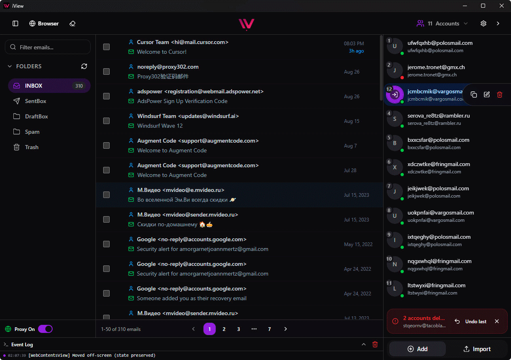

# 🚀 iView - Modern IMAP Email Client

[](https://opensource.org/licenses/MIT)
[](https://electronjs.org)
[](https://reactjs.org)
[](https://typescriptlang.org)

> **Modern, feature-rich IMAP email client built with Electron, React, and TypeScript. Fully local application with no external dependencies, API keys, or cloud services. All data stored locally in simple text files.**

<p align="center">
  
</p>

<p align="center">
  
</p>

## ✨ Key Features

### 🔐 **Multi-Account Management**
- Support for unlimited email accounts
- OAuth2 authentication for Microsoft accounts (Outlook, Hotmail)
- Basic authentication for IMAP servers
- Local credential storage in simple text files
- Account grouping and organization
- Automatic credential detection from clipboard

### 🌐 **Smart Auto-Discovery**
- Automatic email server configuration detection
- Support for 50+ popular email providers
- DNS server autodetect for email settings
- Microsoft Exchange Autodiscover support

### 🏠 **Fully Local Application**
- No external API keys or cloud services required
- All data stored locally in simple text files
- No internet connection required for basic functionality
- Complete privacy - your data never leaves your device

### ⚡ **Performance & Reliability**
- Modern React architecture with hooks and context
- Infinite scroll for large mailboxes
- Background email synchronization
- Robust error handling and recovery

### 🌐 **Advanced Built-in Browser**
- **Secure WebContentsView** - Modern Electron API for maximum security and stability
- **Proxy Integration** - Full proxy support for both email and web browsing
- **Smart Navigation** - Back, forward, refresh, and home controls
- **Context Preservation** - Stay within email context while browsing safely
- **Automatic Proxy Sync** - Browser automatically uses your configured proxy settings

### 🎨 **Modern UI/UX**
- Beautiful dark theme interface
- Responsive design for all screen sizes
- Customizable layouts and panels
- Accessibility-first design

## 📋 Table of Contents

- [Installation](#installation)
- [Quick Start](#quick-start)
- [Features](#features)
- [Configuration](#configuration)
- [Development](#development)
- [Architecture](#architecture)
- [Contributing](#contributing)
- [License](#license)

## 📦 Installation

> **🖥️ Multi-Platform Support**  
> iView is built with cross-platform support for Windows, macOS, and Linux. However, the application has only been tested on **Windows 11 (x64)**. If you encounter issues on other platforms, please [build from source](#building-from-source) or [report an issue](https://github.com/HALDRO/IMAP-Viewer/issues).

### Pre-built Binaries

Download the latest release for your platform:

- **Windows** ✅ *Tested*: 
  - `iView-Setup-x.x.x.exe` (Installer, recommended)
  - `iView-Portable-win32-x64-x.x.x.zip` (Portable version)
- **macOS** ⚠️ *Untested*: 
  - `iView-x.x.x.dmg` (Disk image, recommended)
  - `iView-Portable-darwin-x64-x.x.x.zip` (Archive version)
- **Linux** ⚠️ *Untested*: 
  - `iView-x.x.x.deb` (Debian/Ubuntu package, recommended)
  - `iView-Portable-linux-x64-x.x.x.zip` (Universal archive)


### Building from Source

**Prerequisites:**
- Node.js 22+ (LTS version)
- npm 10+
- Git

```bash
# Clone the repository
git clone https://github.com/HALDRO/IMAP-Viewer.git
cd IMAP-Viewer

# Install dependencies
npm install

# Start development server
npm run dev

# Build for production (current platform)
npm run make

# Build for specific platform
npm run make -- --platform=win32   # Windows
npm run make -- --platform=darwin  # macOS
npm run make -- --platform=linux   # Linux
```

**Build Outputs:**
- Installers: `out/make/squirrel.windows/` (Windows), `out/make/deb/` (Linux), `out/make/` (macOS DMG)
- Portable versions: `out/make/Portable/[platform]/[arch]/`

> **Note:** Cross-platform building may require additional tools. For example, building macOS apps on Windows/Linux requires macOS-specific dependencies. Building for your native platform is always recommended.

## 🚀 Quick Start

1. **Launch iView** - Start the application
2. **Add Email Account** - Click the "+" button and enter your email credentials
3. **Auto-Discovery** - iView will automatically detect your email server settings
4. **Browse Emails** - Select mailboxes and view your messages
5. **Open Links Safely** - Click any link in emails to open in the built-in browser
6. **Configure Proxies** (Optional) - Set up proxy servers for enhanced connectivity:
   - Add proxy servers in Settings → Proxy
   - Test connectivity with real-time IP detection
   - Enable/disable with one click from sidebar
   - Browser automatically uses your proxy settings
7. **Manage Browser Data** (Optional) - Clear browser data when needed:
   - Access via Settings → Browser → Clear Data
   - Removes all cookies, cache, and stored data
   - Useful for privacy or troubleshooting

## 🌟 Features

### Email Management
- **IMAP protocol support** - Full IMAP client functionality
- **Multi-mailbox support** - View all your folders and labels
- **Advanced search** - Search across all emails and folders
- **Attachment handling** - View and download email attachments
- **Mark as read/unread** - Organize your inbox efficiently

### Account Features
- **Microsoft OAuth2** - Secure authentication for Outlook/Hotmail accounts
- **Basic IMAP authentication** - Standard username/password for IMAP servers
- **Bulk import** - Import multiple accounts from text files
- **Connection monitoring** - Real-time connection status
- **Auto-reconnect** - Automatic reconnection on network issues

### 🔒 **Advanced Proxy Support**
- **Multiple proxy types** - HTTP, HTTPS, SOCKS4, SOCKS5 with authentication
- **Global proxy system** - Single proxy configuration for all connections
- **Real-time testing** - Live proxy connectivity testing with IP detection
- **Browser integration** - Web browser automatically uses your proxy settings
- **Quick toggle** - Enable/disable proxy with one click from sidebar
- **Smart bypass** - Automatic bypass for localhost and local networks

### 🌐 **Built-in Browser Features**
- **Secure WebContentsView** - Latest Electron API for maximum security
- **Proxy-aware browsing** - Automatically routes through your configured proxy
- **Full browser controls** - Back, forward, refresh, and home navigation
- **Error recovery** - Automatic retry mechanism for failed page loads
- **Context preservation** - Stay within email context while browsing safely
- **Isolated environment** - Safe web content rendering with proper isolation
- **Real-time proxy sync** - Browser proxy settings update automatically
- **Comprehensive anti-fingerprinting** - Complete data clearing across all partitions with one click:
  - All storage types (cookies, cache, localStorage, IndexedDB, service workers)
  - Fingerprinting vectors (WebGL shader cache, DNS cache, compiled code caches)
  - Authentication data (HTTP Auth credentials)
  - Both browser contexts (main in-app browser + external windows)
- **WebRTC IP leak protection** - Smart policy prevents real IP exposure while keeping WebRTC API functional (critical for avoiding fraud detection)

### Advanced Features
- **Keyboard shortcuts** - Navigate efficiently with keyboard
- **Customizable UI** - Adjust panel sizes and layouts
- **Event logging** - Monitor application and connection events
- **Settings management** - Comprehensive configuration options

## ⚙️ Configuration

### Account Setup

iView stores account configurations in simple text files. The application supports multiple authentication methods:

#### Basic Authentication Format
Accounts are stored in `data/accounts.txt` in the following format:
```
email:password
user@example.com:your-password
```

#### OAuth2 Authentication (Microsoft)
For Microsoft accounts, the format includes additional OAuth2 fields:
```
email:password:refreshToken:clientId
user@outlook.com:password:refresh-token:client-id
```


### Proxy Configuration

**🌐 Global Proxy System**
iView supports a unified proxy system that works for both email connections and web browsing:

**Proxy Storage Format** (`data/proxies.txt`):
```
type:host:port:username:password
socks5:127.0.0.1:1080:user:pass
http:proxy.example.com:8080
https:secure-proxy.com:443:user:pass
```

**Supported Proxy Types:**
- **HTTP/HTTPS** - Standard web proxies
- **SOCKS4/SOCKS5** - Advanced tunneling proxies
- **Authentication** - Username/password support for all types

**Global Configuration:**
```typescript
{
  enabled: boolean,
  type: "http" | "https" | "socks4" | "socks5",
  hostPort: string,
  auth: boolean,
  username?: string,
  password?: string
}
```

**✨ Key Features:**
- **Real-time Testing** - Live connectivity testing with IP detection
- **Browser Integration** - Web browser automatically uses proxy settings
- **Quick Toggle** - Enable/disable from sidebar widget
- **Smart Bypass** - Automatic bypass for localhost and local networks
- **Unified Management** - Single proxy configuration for all connections

## 🏗️ Architecture

iView follows modern software architecture patterns:

### Frontend Architecture
- **React 18** with hooks and functional components
- **TypeScript** for type safety
- **Zustand** for state management
- **React Hook Form** for form handling
- **Tailwind CSS** for styling

### Backend Architecture
- **Electron** main process with WebContentsView API
- **IMAPFlow** for IMAP connections with proxy support
- **Microsoft OAuth2** for Outlook/Hotmail authentication
- **Proxy Integration** - Unified proxy system for email and browser
- **Pino** for logging
- **Zod** for schema validation

### Project Structure
```
src/
├── components/          # React components
│   ├── AccountManager/  # Account management UI
│   ├── EmailListPanel/  # Email list and folders
│   ├── EmailViewer/     # Email content viewer
│   ├── SettingsPanel/   # Settings and configuration
│   ├── InAppBrowser.tsx # WebContentsView browser component
│   ├── ProxyStatusWidget.tsx # Proxy status and controls
│   └── ClearBrowserDataDialog.tsx # Browser data clearing dialog
├── services/           # Business logic services
│   ├── accountService.ts
│   ├── imapFlowService.ts
│   ├── proxyService.ts
│   ├── proxyTester.ts  # Real-time proxy testing
│   └── autoDiscoveryService.ts
├── shared/             # Shared code
│   ├── hooks/          # Custom React hooks
│   │   ├── useProxyManager.ts # Proxy management
│   │   └── useProxyStatus.ts  # Proxy status monitoring
│   ├── store/          # Zustand stores
│   ├── types/          # TypeScript type definitions
│   └── utils/          # Utility functions
├── ipc/                # IPC communication handlers
│   ├── browser.ts      # WebContentsView management
│   └── proxy.ts        # Proxy configuration
└── main.ts             # Electron main process with WebContentsView
```

## 🔧 Development

### Prerequisites
- Node.js 22+ (LTS version)
- npm 10+
- Git

### Setup
```bash
# Clone repository
git clone https://github.com/HALDRO/IMAP-Viewer.git
cd IMAP-Viewer

# Install dependencies
npm install

# Start development server
npm run dev

# Lint code
npm run lint

# Format code
npm run format
```

### Building
```bash
# Build for current platform
npm run make

# Build with debug output
npm run make:debug

# Build for specific platform (cross-compilation may have limitations)
npm run make -- --platform=win32   # Windows
npm run make -- --platform=darwin  # macOS (requires macOS or specific dependencies)
npm run make -- --platform=linux   # Linux
```

**Output locations:**
- Installers: `out/make/squirrel.windows/`, `out/make/deb/`, `out/make/` (DMG)
- Portable builds: `out/make/Portable/[platform]/[arch]/`

## 🤝 Contributing

We welcome contributions! Please see our [Contributing Guide](CONTRIBUTING.md) for details.

### How to Contribute
1. Fork the repository
2. Create a feature branch (`git checkout -b feature/amazing-feature`)
3. Commit your changes (`git commit -m 'Add amazing feature'`)
4. Push to the branch (`git push origin feature/amazing-feature`)
5. Open a Pull Request

### Development Guidelines
- Follow TypeScript strict mode
- Write tests for new features
- Update documentation
- Follow conventional commit format

## 📝 License

This project is licensed under the MIT License - see the [LICENSE](LICENSE) file for details.

## 🙏 Acknowledgments

- **IMAPFlow** - Excellent IMAP client library
- **Electron** - Cross-platform desktop framework
- **React** - UI framework
- **ShadCN/UI** - Beautiful UI components
- **Tailwind CSS** - Utility-first CSS framework

---

<p align="center">
  <strong>⭐ Star this project if you find it useful!</strong>
</p>

<p align="center">
  <a href="#installation">Installation</a> •
  <a href="#features">Features</a> •
  <a href="#contributing">Contributing</a> •
  <a href="#license">License</a>
</p>
